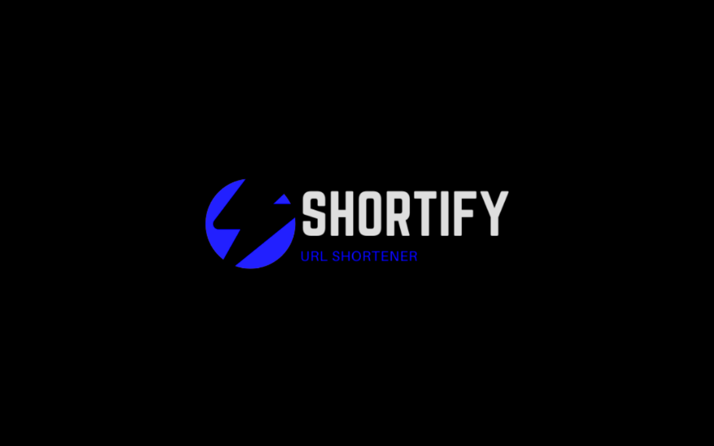

# Shortify - URL Shortener

# Steps to install
- Download and unzip this repository.
- Open Chrome Extension and enable developer mode.
- Click on load unpack and select the folder where the extension is loaded.
- Enjoy the Best Shortener Ever!
- [DEMO](https://youtu.be/cjA4UT78keY)

# `Fastest URL Shortener`
